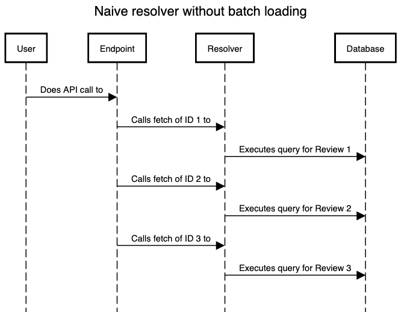
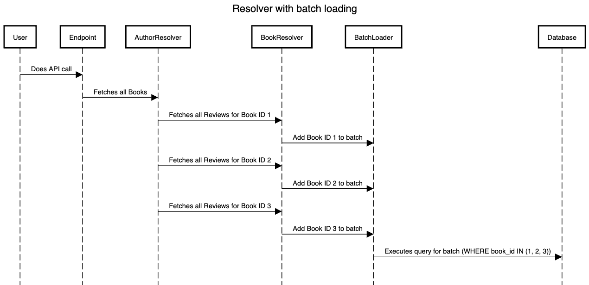

<!--more-->

This post will help you understand the N+1 query problem in a GraphQL API and show you how to use [java-dataloader](https://github.com/graphql-java/java-dataloader)
to fix this problem. Personally I have used this library for one of my clients that ran into performance issues. **It improved the performance by
around 60% to 80%!** These improvements made sure they could build further upon a solid base.

## The N+1 Query problem

Choosing to build a GraphQL API over a REST API can help avoid overfetching and your API will be less prone to backwards-incompatible schema changes. But
building a GraphQL API without keeping an eye on your database queries might lead to accidently building a very inefficient API call. This might happen because:

- Your resolvers are inefficient
- The frontend does a giant recursive fetch of the whole graph in one API call, instead of multiple smaller (paginated) API calls

#### Let's look at an example

Imagine we have a simple data model containing `books`, `authors` and `reviews`.

An *author* can have multiple *books*, a *book* can have multiple *reviews*.

The frontend does the following API call to load the page's data:

```graphql
query {
  author(id: "1") {
    name
    books {
        name
        reviews {
            text
        }
    }
  }
}
```

Creating simple resolvers without data loaders will result in an N+1 fetch. The SQL that will be generated by using JPA relationships in your resolver will look
something like the following:


```sql
SELECT id, name FROM authors WHERE id = 1;

SELECT id, name FROM books WHERE author_id = 1;
/* Query above gives the following book ID's: [1, 2, 3] */

SELECT id, name FROM reviews WHERE book_id = 1;
SELECT id, name FROM reviews WHERE book_id = 2;
SELECT id, name FROM reviews WHERE book_id = 3;
/* etc... */

/* For each ID, a separate query is executed */
```
^ *Simplified pseudo-SQL to get the point across:*

As you can see, a new query is generated for each book we find. In this example it is only 3 records, but in a larger application this can result in thousands of unnecessary
queries. This means there will be a lot of load on the database, and it will make your API call slow. In the case of my client it resulted in bad performance or even brief
periods of database downtime.

This happens because GraphQL resolvers always assume you're calling them with a single ID. This is visible in our old resolver setup. In my clients codebase,
the resolver was set up like this:

```java
@Component
@RequiredArgsConstructor
public class BookResolver implements GraphQLResolver<Review> {
  public List<Review> getReviews(Book book) {
    return book.getReviews();
  }
}
```
^ *The old resolver*

So this resolver is being called for each book ID that we fetched in another resolver. As the code is executed in real time, there is no way to combine the database
calls. We don't know if there will be only one call, multiple calls or how long the remaining list of ID's is.

A simplified overview of what will happen:



This is the reason GraphQL came up with [batch loading](https://docs.gitlab.com/ee/development/graphql_guide/batchloader.html). As we are using a Java Spring Boot
API in this example, we will use [java-dataloader](https://github.com/graphql-java/java-dataloader) to implement batch loading.

## Using java-dataloader

First, add the java-dataloader dependency to your project using the [official installation instructions](https://github.com/graphql-java/java-dataloader#installing). 

To start using data loaders, we will have to create two things:

- A data loader registry
- A data loader

#### Creating the data loader registry

In my clients' codebase, there was already a `com.client.backend.graphql` Java package. So to keep everything neat and tidy, we will create a new `com.client.backend.graphql.dataloader`
package. In here, we will create a factory to create a new data loader registry:

```java
@Component
public class DataLoaderRegistryFactory {

  private final ReviewRepository reviewRepository;

  // Needed because postgres allows a maximum of ~30000 query parameters.
  private static final int MAX_BATCH_SIZE = 30000;

  public DataLoaderRegistryFactory(ReviewRepository reviewRepository) {
    this.reviewRepository = reviewRepository;
  }


  public DataLoaderRegistry build() {
    var options = DataLoaderOptions.newOptions().setMaxBatchSize(MAX_BATCH_SIZE);

    var reviewDataLoader = DataLoaderFactory.newMappedDataLoader(new ReviewsBatchLoader(reviewRepository), options);

    return DataLoaderRegistry.newRegistry()
            .register(ReviewBatchLoader.KEY, reviewDataLoader)
            .build();
  }
}
```
*^ com.client.backend.graphql.dataloader.DataLoaderRegistryFactory*

This registry is needed to register our future data loaders. Just a bit of patience, we will create the ReviewBatchLoader shortly :wink:. This registry is also
the place where you can configure global settings for all your data loaders. Like for example the maximum batch size.

#### Creating a data loader

After we created the registry, we can create our first data loader. Let's look at the full code and then break each part of it down:

```java
public class ReviewsBatchLoader implements MappedBatchLoader<Integer, List<Review>> {

  public static final String KEY = "REVIEWS_BATCH_LOADER";

  private final ReviewRepository reviewRepository;

  public ReviewsBatchLoader(ReviewRepository reviewRepository) {
    this.reviewRepository = reviewRepository;
  }

  @Override
  public CompletionStage<Map<Integer, List<Review>>> load(Set<Integer> bookIds) {
    return CompletableFuture.supplyAsync(() -> {
      // If possible, return a map of { id: [Review] } straight out of the repository to avoid
      // having to build the map yourself.
      var reviews = reviewRepository.findAllByBookIdIn(bookIds.stream().toList());

      // If it's not possible to return a map directly from the repository, you can use something
      // like this to build the map yourself.
      return bookIds.stream()
              .collect(
                      HashMap::new,
                      (map, bookId) -> map.put(
                              bookId,
                              reviews.stream()
                                      .filter(review -> Objects.equals(bookId, review.getBook().getId()))
                                      .toList()
                      ),
                      HashMap::putAll
              );
    });
  }
}
```
*^ com.client.backend.graphql.resolvers.ReviewsBatchLoader*

So let's go over each part of the batch loader to understand the code:

```java
public CompletionStage<Map<Integer, List<Review>>> load(Set<Integer> bookIds) {
}
```

The function signature is a bit complex, but will make sense after you give it a bit of thought. The return value is a [CompletionStage](https://docs.oracle.com/javase/8/docs/api/java/util/concurrent/CompletionStage.html)
which means that the result of this function is an asynchronous operation. Why does it need to be asynchronous? Because we do not want to load (fetch) the data
immediately when the load function is called. Only when we have a batch of ID's that is large enough, we want to execute a single load that loads the full batch.
Loading the full batch in a single query will avoid having to execute one query for each element that we want to load. We will come back to this later.

The body of the CompletionStage is a `CompletableFuture`. The body of the completable future should be calling the data fetching layer
(most likely repositories). Make sure to use a query that fetches the entire batch (SQL `SELECT WHERE id IN (...)` query)! If we put a singlar fetch in a
loop we will still end up with N+1 queries, which will not give us the performance improvement we want.

The return value should be a `Map`. Why a `Map`? After our data is returned from the resolver, GraphQL needs to know which set of reviews belongs to which book.
In our example the map looks like this:

```javascript
{
  /* BookId: [Review] */
  1: [review1, review2],
  2: [review5, review6, review9],
  3: [review4, review20]
}
```

Now our resolver knows exactly what set of reviews belongs to a certain book.

```java
... load(Set<Integer> bookIds) {
```

The input argument of the `load` function is a `Set` of book ID's. This is **one batch** of ID's that the batch loader receives. So how are these batches created?
Let's take a look at our resolver.

To add calls to a batch, we will need to change our resolver:

```java
@Component
@RequiredArgsConstructor
public class BookResolver implements GraphQLResolver<Review> {
  public List<Review> getReviews(Book book, DataFetchingEnvironment environment) {
    var registry = environment.getDataLoaderRegistry();
    DataLoader<Integer, List<Review>> dataLoader = registry.getDataLoader(ReviewsBatchLoader.KEY);

    return dataLoader.load(book.getId());
  }
}
```
*^ com.client.backend.graphql.resolvers.BookResolver*

As you can see, the resolver still calls `dataloader.load(id)` N times. But because we use a `BatchLoader`, the call will not happen immediately. Remember that
the implementation of our batch loader was asynchronous? It will batch all calls until the max batch size has been reached. Only after this size has been reached
it will dispatch the call. You can also configure when a batch should be dispatched by setting a [DispatchPredicate](https://github.com/graphql-java/java-dataloader#scheduled-registry-dispatching).

This way, all calls will be halted and gathered until a batch has been filled. Then the batch will be dispatched, which executes the query that fetches the entire
batch.

A simplified overview of what will happen in the new scenario:



As you can see, the new code will no longer result in N+1 queries - but in 1 query. This is way better for database load and will load your data much quicker than brute
forcing your database with separate queries.

## Conclusion

When building a GraphQL API, make sure to check if your resolvers result in efficient database queries. When running into the N+1 query problem, using batch loading can reduce the load on your database quite a bit. When
your application grows, it can even prevent very slow load times or even downtime.

In our case, we discovered that the cause of our slow load times and eventually database downtime was the N+1 query problem by using application performance
monitoring in [Datadog](https://www.datadoghq.com/). Make sure to set up good monitoring for your application, so you can tackle these problems before they reach
production!
